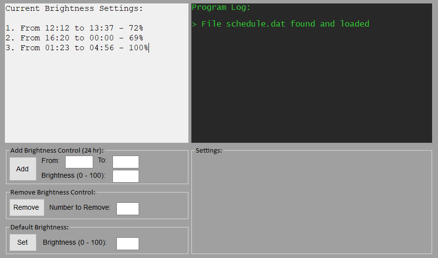

# Brightness-Scheduler
A program that dims and brightens windows tablets and laptops.

## Getting Started

Download and run the windows binaries on a windows 10 laptop or tablet. Adding a "brightness control" lets you set a specific brightness between two times. All time values are in the 24 hour format "HH:mm". To remove a brightness control enter the number you see in the "Current Brightness Settings:" window.

